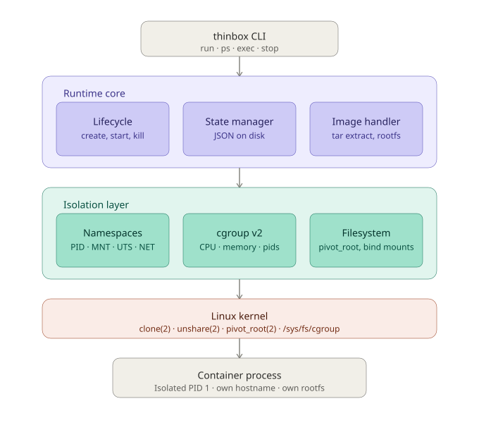
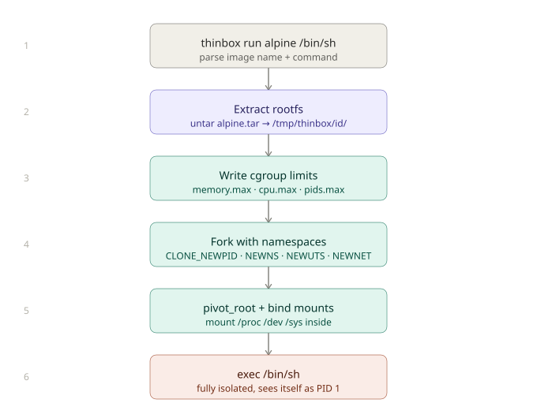
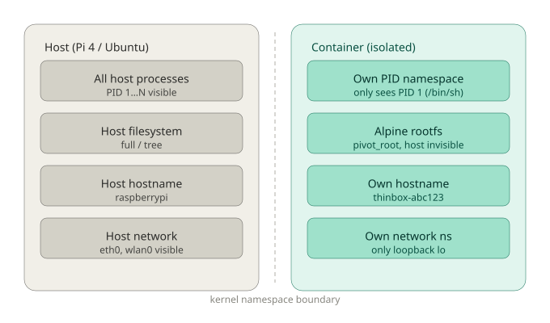

# thinbox

[](https://github.com/Ahmedaltu/thinbox/actions/workflows/ci.yml)
[](https://go.dev/)
[](LICENSE)

A lightweight Linux container runtime written in Go.

thinbox runs isolated processes using Linux namespaces and cgroup v2 directly —
no Docker, no containerd, no daemon. Designed for edge Linux devices like the
Raspberry Pi 4.

```bash
sudo thinbox run alpine /bin/sh
```

> thinbox is a learning-grade runtime, not for production. Built to understand
> the kernel primitives that runc, LXD, and containerd are built on.

---

## How it works

thinbox talks directly to the Linux kernel — no daemon, no middleman:

```
thinbox CLI
    ↓
Linux kernel (clone · pivot_root · /sys/fs/cgroup)
    ↓
Isolated container process (PID 1, own rootfs, own hostname)
```



### Isolation primitives

| Primitive | What it does |
|---|---|
| `CLONE_NEWPID` | Container gets its own PID namespace, sees itself as PID 1 |
| `CLONE_NEWNS` | Container gets its own mount namespace |
| `CLONE_NEWUTS` | Container gets its own hostname |
| `CLONE_NEWNET` | Container gets its own network namespace |
| `cgroup v2` | CPU, memory, and PID limits enforced by the kernel |
| `pivot_root` | Container's `/` is redirected to the extracted rootfs |

### Startup sequence



---

## Requirements

- Linux kernel 5.x+ with cgroup v2 enabled
- Go 1.22+
- Root privileges (`CAP_SYS_ADMIN` required for namespace creation)

Tested on:
- Ubuntu 22.04 x86\_64
- Raspberry Pi 4 (Ubuntu 22.04 arm64)

---

## Build

```bash
git clone https://github.com/Ahmedaltu/thinbox
cd thinbox
go build -o thinbox ./cmd/thinbox
```

---

## Usage

```bash
# Run a shell in an Alpine container
sudo ./thinbox run alpine /bin/sh

# Run with resource limits
sudo ./thinbox run --memory 64m --cpu 0.5 --pids 20 alpine /bin/sh

# List running containers
sudo ./thinbox ps
```

---

## Project structure

```
thinbox/
├── cmd/thinbox/        # CLI entrypoint
├── internal/
│   ├── container/      # namespace setup, cgroups, pivot_root, lifecycle
│   ├── state/          # container state persistence (JSON)
│   └── image/          # rootfs image extraction
├── diagrams/           # architecture diagrams
├── benchmarks/         # startup latency and throughput benchmarks
└── go.mod
```

---

## Getting an Alpine rootfs

thinbox uses plain tar archives as images:

```bash
mkdir -p /var/lib/thinbox/images
wget -O /var/lib/thinbox/images/alpine.tar \
  https://dl-cdn.alpinelinux.org/alpine/v3.19/releases/x86_64/alpine-minirootfs-3.19.1-x86_64.tar.gz
```

---

## Benchmarks

On Raspberry Pi 4 (Ubuntu 22.04, kernel 5.15):

| Metric | thinbox | Docker |
|---|---|---|
| Container startup latency | TBD | ~180ms |
| Daemon memory (idle) | 0 MB | ~110 MB |
| Binary size | TBD | N/A |

*Benchmarks in progress — see `benchmarks/`.*

---

## Why not Docker?

Docker solves a different problem. For a Pi 4 running a signal processing
pipeline, the Docker daemon's idle overhead (~110MB RAM, always-on process)
is real cost. thinbox has zero idle overhead — it only exists when a
container is starting or running.



---

## Related projects

- [runc](https://github.com/opencontainers/runc) — OCI reference runtime (production grade)
- [LXD](https://github.com/canonical/lxd) — Canonical's full system container manager
- [crun](https://github.com/containers/crun) — fast OCI runtime in C

---

## License

MIT
